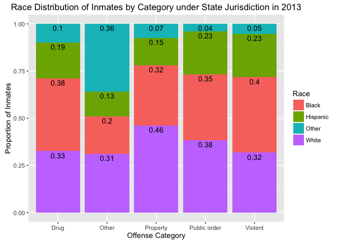

MATH 216 Data Science Final Project (Fall 2016)
================

-   Name: Amanda Hotvedt
-   Project title: Trends in US Federal and State Prisoner Statistics
-   Write-up on RPubs: <http://rpubs.com/ahotvedt/finalwriteup>
-   Abstract: The following report explores trends in prisoner statistics for inmates in the United States under either state or federal correctional authority. Most of the data used for this analysis came from the [U.S. Bureau of Justice Statistics](http://www.bjs.gov/index.cfm?ty=pbdetail&iid=5387), and a few other supplementary sources were used to shed light on trends in the BJS data. The results of an Exploratory Data Analysis suggest that there are correlations between race and type of offense that inmates are serving time for. Additionally, the proportion of Whites, Blacks, and Hispanics serving time in U.S. state and federal prisons do not match up with the racial breakdown of the overall U.S. population. Finally, the analysis demonstrates that each state in the U.S. have slightly different levels of imprisonment with respect to the state's population. States such as Florida, Texas, Georgia, and Arizona have high imprisonment rates compared to the average, while California, New York, New Jersey, and others have relatively low imprisonment rates.

 

